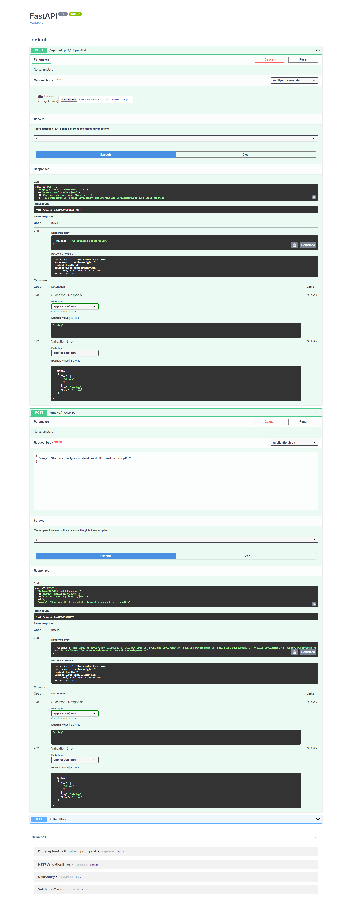
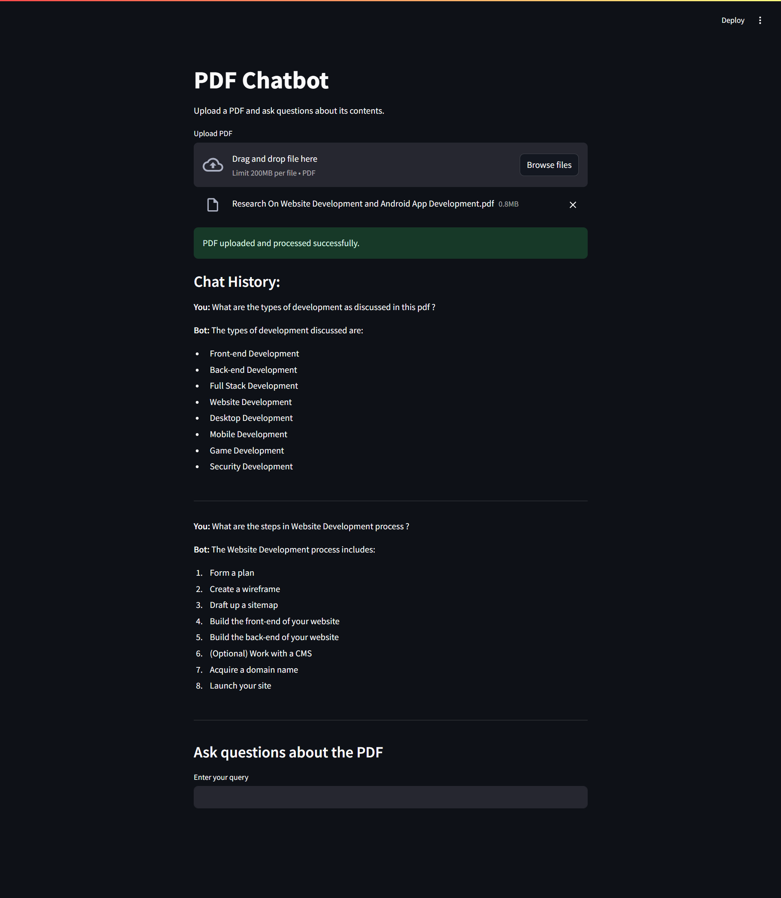

# PDF Chatbot

## Overview

The **PDF Chatbot** project is a web application that allows users to upload a PDF and interact with its content through a chatbot interface. This project leverages Gemini AI (a generative AI model) for generating responses based on the content of the PDF. The backend is built with FastAPI, and the frontend is developed using Streamlit. The project utilizes Retrieval-Augmented Generation (RAG) techniques to enhance the chatbot's responses.


## Project Structure

The project is divided into two main components: **Backend** and **Frontend**. The structure is as follows:


pdf_chatbot/
├── backend/
│ ├── main.py # FastAPI backend application
│ ├── gemini_client.py # Gemini API client integration
│ ├── .env # Environment variables
│
├── frontend/
│ ├── app.py # Streamlit frontend application
│
├── tests/
│ ├── backend/
│ │ └── test_main.py # Unit tests for FastAPI endpoints
│ ├── frontend/
│ │ └── test_app.py # Unit tests for Streamlit application
│
├── screenshots/
│ ├── fastapi_swagger_ui.png # Swagger UI screenshot (FastAPI)
│ ├── streamlit_app.png # Streamlit app screenshot (Frontend)
│
├── requirements.txt # Project dependencies
├── venv/ # Python virtual environment
└── README.md # Project documentation


## Installation

1. **Clone the repository:**

    ```bash
    git clone https://github.com/Gitkakkar1597/PDF-Chatbot.git
    cd pdf_chatbot
    ```

2. **Create a virtual environment and activate it:**

    ```bash
    python -m venv venv
    source venv/bin/activate  # On Windows use `venv\Scripts\activate`
    ```

3. **Install the dependencies:**

    ```bash
    pip install -r requirements.txt
    ```

4. **Create a `.env` file in the `backend` directory and add your Gemini API key:**

    ```env
    # Gemini API Key
    API_KEY=<your_gemini_api_key>
    ```

## Usage

### Running the Application

1. **Start the FastAPI backend:**

    ```bash
    uvicorn backend.main:app --reload
    ```

    The backend will be available at [http://127.0.0.1:8000](http://127.0.0.1:8000).

2. **Start the Streamlit frontend:**

    ```bash
    streamlit run frontend/app.py
    ```

    The frontend will be available at [http://localhost:8501](http://localhost:8501).

### Interacting with the Application

1. **Upload a PDF:**

    - Navigate to the Streamlit interface.
    - Use the "Upload PDF" button to upload a PDF file.

2. **Ask a Question:**

    - After uploading a PDF, enter your query in the text input box and click "Send".
    - View the chatbot's response and continue asking questions as needed.

## API Endpoints

### `POST /upload_pdf/`

Uploads a PDF file to the server.

**Request:**
- **Form Data**: `file` (PDF file)

**Response:**
- `200 OK` with a message: `{"message": "PDF uploaded successfully."}`
- `400 Bad Request` for invalid file formats

### `POST /query/`

Queries the uploaded PDF content using the AI model.

**Request:**
- **Body**: JSON object with `query` (string)

**Response:**
- `200 OK` with the AI response: `{"response": "<response from Gemini AI>"}`
- `400 Bad Request` if no PDF is uploaded or if there's an issue with the query

## Testing

To ensure the application is functioning correctly, run the unit tests:

1. **Run backend tests:**

    ```bash
    pytest tests/backend/test_main.py
    ```

2. **Run frontend tests:**

    ```bash
    pytest tests/frontend/test_app.py
    ```


## Screenshots

- **FastAPI Swagger UI:**
    

- **Streamlit App:**
    

## Workflow of PDF Chatbot Application

### Overview

The PDF Chatbot application provides a seamless interaction with PDF documents through a chatbot interface. The application consists of:

- **Backend:** FastAPI handles PDF uploads and queries, interacts with Gemini AI for response generation.
- **Frontend:** Streamlit allows users to upload PDFs and interact with the chatbot.
- **AI Model:** Gemini AI processes queries based on the content of the uploaded PDFs using Retrieval-Augmented Generation (RAG) techniques.

### Workflow

1. **User Interaction with the Streamlit Frontend:**
   - Navigate to [http://localhost:8501](http://localhost:8501).
   - Upload a PDF through the Streamlit interface.

2. **FastAPI Backend Processing:**
   - FastAPI receives and processes the uploaded PDF.
   - Extracts text from the PDF and stores it for querying.

3. **Querying the PDF:**
   - After uploading, the user submits a query through the Streamlit interface.
   - FastAPI handles the query, retrieves the PDF content, and sends it along with the query to Gemini AI.

4. **Response Generation:**
   - Gemini AI generates a response based on the query and the extracted PDF content.
   - The response is sent back to the FastAPI backend.

5. **Displaying the Response:**
   - FastAPI sends the response to the Streamlit frontend.
   - Streamlit displays the chatbot's response and updates the chat history.

6. **Continuing Interaction:**
   - The user can continue to ask questions, with the chat history maintaining all interactions.

### Summary

The application involves:
1. **Uploading a PDF** via Streamlit.
2. **Processing the PDF** with FastAPI.
3. **Handling queries** and generating responses using Gemini AI.
4. **Displaying responses** and maintaining chat history in Streamlit.
5. **Continuing interactions** as needed.

This workflow ensures an efficient and user-friendly experience for interacting with PDF documents through a chatbot interface.

## Contributing

Contributions are welcome! Please follow these steps to contribute:

1. Fork the repository.
2. Create a new branch (`git checkout -b feature-branch`).
3. Make your changes and commit them (`git commit -am 'Add new feature'`).
4. Push to the branch (`git push origin feature-branch`).
5. Create a pull request.